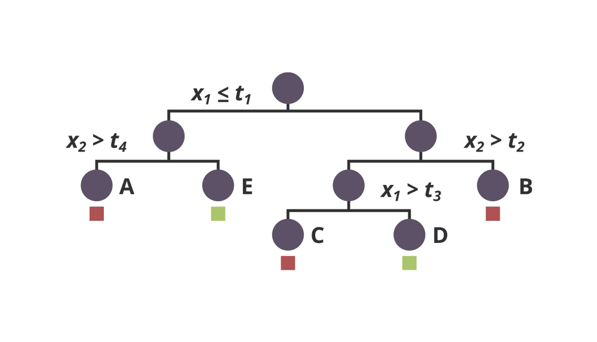
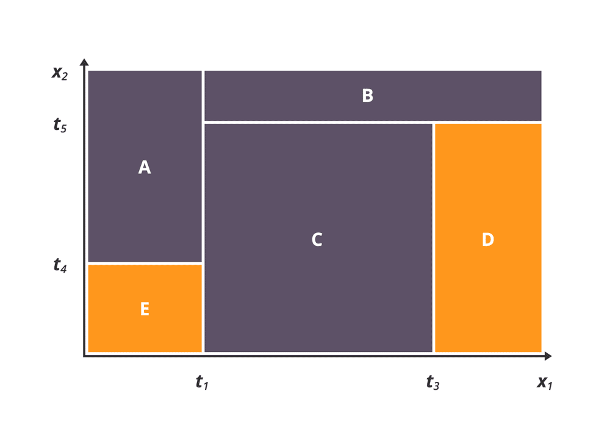

# STEM Girls 4 Social Good - Modeling Using Decision Trees

## What is Data Driven Modeling?
Have you ever wondered how Pandora picks songs for you to listen to? Or how Netflix reccommends movie that you like? Or why the milk is always in the back of the store? The answer is data driven modeling (DDM). DDM is a method of utilizing data to discover, predict, or recommend. Whether the goal is to discover the best store layout (optimizing a customers time in store) or predicting what comedic film would entertain you (finding others with similar interests) there is data as the input to an algorithm or method and information as the output. 

# insert graphic for modeling process

## Overview
Decision trees are models that split the input space into non-overlapping subsets of the original data. The tree fits a unique model to each subset, which may be as simple as a value (e.g., True or False). Decision trees get their name due to the tree-like structure that emerges from the model.

Here is an example of a decision tree on two attributes of \\(x\\)  (\\(x_1\\) and \\(x_2\\)) and two predicted classes (red and green).

The top node represents the set of all observations of \\(x\\). The tree splits the set into two subsets, one where attribute \\(x_1\\) is less than or equal to some threshold \\(t_1\\) and the other where attribute \\(x_2\\) is greater than that threshold. The partitioning continues on the resulting subsets in a recursive manner, resulting in the final tree model, where we've labeled the leaf nodes as A, B, C, D, and E.

We would see the following in the \\((x_1, x_2)\\) space if we were to visualize the subsets represented by the leaf nodes of the decision tree.

We've just shown an example of a decision tree used for classification.

## Training the Model
Specific algorithms like vary in implementation details, but in general follow the same principles of recursive divide and conquer. At the root node, the algorithm considers all variables \\(x_1,x_2,...\\) and thresholds \\(t_1,t_2,..\\), and determines which variable and which threshold results in the "best" split of the data. "Best" is detemined by a measure of accuracy at the child nodes, which is usually based on information theoretic measures. The recursion continues until it hits termination criteria, such as tree depth, or the number of remaining observations at the leaf node.

## Random Forests

A random forest is a collection of decision trees. Each of the trees is constructed from a different subset of the data, and often the depth of the tree is limited to a small value. Different randomizations may occur where an individual tree may split on a random subset of variable attributes and the thresholds selected for the splits can be randomly selected. For example, a random forest might consist of 100 decision trees, each trained on a randomly selected 80% of the data. For each tree, only a subset of the attributes will be used to split nodes in the tree.

You would think that this results in poorly performing trees, which it does. However, when you combine the results of several ok-but-not-great models, the average over all trees produces very good results. Random forests generate the prediction by aggregating predictions over all trees by majority vote or by weighting the predictions of each tree. The randomization and aggregation present in random forests are quite effective at preventing overfitting and dealing with noisy data.
