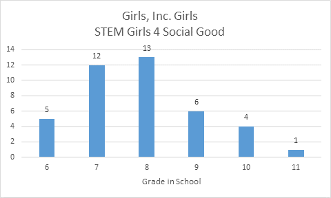

# STEM Girls 4 Social Good

*Handouts must be ready July ? for printing*

## Activity Schedule by Day

### Monday (Samantha, )
* Data Exploration - 
* Data Modeling - Overview: What is data driven modeling?, interactive vocabulary discussion.
* Social Networks -

### Tuesday (Samantha, )
* Data Exploration - 
* Data Modeling - What are decision trees and how do they work?, 
* Social Networks -

### Wednesday (Stephanie R, Samantha, )
* Data Exploration - 
* Data Modeling - Playing with the human trafficking model, interactive feature selection.
* Social Networks -

### Thursday (Stephanie R, Samantha, )
* Data Exploration - 
* Data Modeling - Can we over teach our model?, interactive overfitting lesson.
* Social Networks -

### Friday (Stephanie R, Samantha, )
* Presentations

## Resources
[Data Science for kids experiment](http://www.datasciencekids.org/p/home-page.html?m=1)

[United Nations Global Initiative to Fight Human Trafficking: Profiling the Traffickers](https://www.unodc.org/documents/human-trafficking/2008/BP016ProfilingtheTraffickers.pdf)

